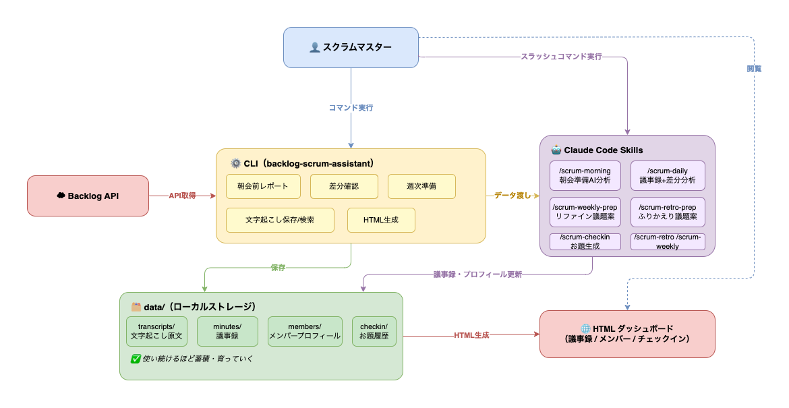
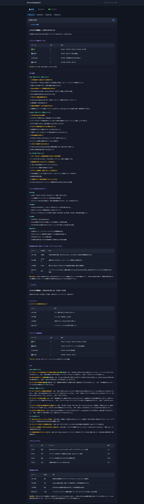
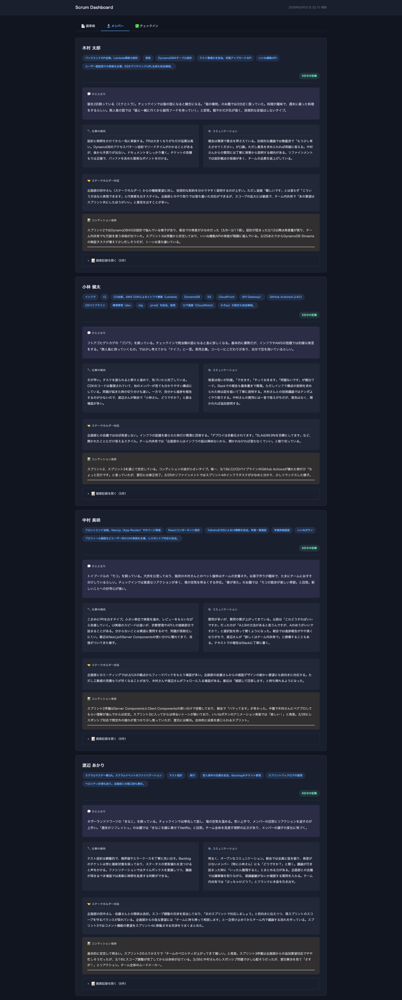
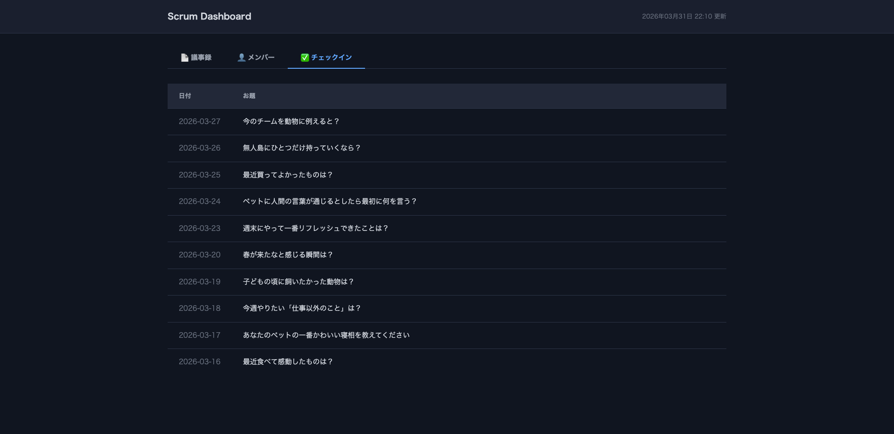

# Backlog Scrum Assistant

スクラムマスターの運営業務を支援する CLI + [Claude Code](https://docs.anthropic.com/en/docs/claude-code) Skill。

- **朝会前**: Backlog の直近アクティビティと停滞課題を整理し、報告前の状況把握と指摘ポイントを準備
- **朝会・チーム内共有後**: 文字起こしを議事録として保存し、口頭報告と Backlog の差分を可視化
- **リファインメント/ふりかえり前**: 今週の動きと Backlog から議題候補を先出し
- **チェックインお題**: 過去履歴とメンバー情報をもとに AI がお題を 5 つ提案
- **メンバープロフィール**: 毎回の会議記録から役割・傾向・コンディションを日次蓄積
- **ダッシュボード**: 議事録・メンバープロフィール・チェックイン履歴を HTML で出力し、ブラウザで GUI 確認できる

CLI は Backlog データの取得・整形・保存に特化。AI 分析・要約・プロフィール更新は Claude Code のスラッシュコマンドが担う。



## DEMO（ダッシュボード）







## 前提条件

- Python 3.10+
- [Claude Code](https://docs.anthropic.com/en/docs/claude-code) がインストール済み
- Backlog API キー（Backlog > 個人設定 > API > 新しい API キーを発行）

## セットアップ

```bash
# 1. リポジトリをクローン
git clone <repository-url>
cd backlog-scrum-assistant

# 2. 依存パッケージのインストール
pip install requests click

# 3. 環境変数の設定
cp .env.example .env
# .env を編集してBacklog APIキー等を設定

# 4. 動作確認
python3 cli.py morning

# 5. Claude Codeをこのディレクトリで起動
claude
```

## スラッシュコマンド（Claude Code 上で実行）

| コマンド             | タイミング          | 内容                                                              |
| -------------------- | ------------------- | ----------------------------------------------------------------- |
| `/scrum-checkin`     | 朝会前              | チェックインお題を 5 つ生成 → 選択 → 履歴保存                     |
| `/scrum-morning`     | 朝会前              | Backlog の直近アクティビティをメンバー別に AI 要約                |
| `/scrum-daily`       | 朝会+チーム内共有後 | 文字起こし → 議事録保存+Backlog 差分検出+メンバープロフィール更新 |
| `/scrum-weekly-prep` | リファインメント前  | 顧客向け議題案を生成（中長期スケジュール、スコープ調整等）        |
| `/scrum-weekly`      | リファインメント後  | 文字起こし → スプリントサマリ+議題生成+メンバープロフィール更新   |
| `/scrum-retro-prep`  | ふりかえり前        | 今週の動きから KPT 議題案を生成                                   |
| `/scrum-retro`       | ふりかえり後        | 文字起こし+miro スクショ →KPT 整理+メンバープロフィール更新       |

## CLI コマンド（直接実行）

```bash
# 朝会前：直近のBacklog変更をメンバー別に出力
python3 cli.py morning

# 朝会後：文字起こしとBacklog課題の突き合わせデータ出力
python3 cli.py sync -f transcript.txt

# リファインメント前：スプリントサマリ+シグナル検出+議題候補
python3 cli.py weekly

# チェックインお題の履歴管理
python3 cli.py checkin
python3 cli.py checkin-save "お題テキスト"

# 議事録の保存（種別: standup / team / refinement / retro / other）
python3 cli.py save-daily standup -f transcript.txt
python3 cli.py save-daily team -f team_transcript.txt

# 議事録のキーワード検索
python3 cli.py search-daily "キーワード"
python3 cli.py search-daily "キーワード" -m メンバー名

# ダッシュボードHTML生成
python3 cli.py html                    # data/ から生成
python3 cli.py html --demo             # デモデータから生成
python3 cli.py html -o path/index.html # 出力先を指定
```

## ディレクトリ構成

```
backlog-scrum-assistant/
├── .claude/commands/     ← スラッシュコマンド定義
├── cli.py                ← メインCLI
├── backlog_client.py     ← Backlog APIクライアント
├── config.py             ← 設定読み込み（.envから）
├── .env                  ← 環境変数（gitignore対象）
├── .env.example          ← 環境変数テンプレート
└── data/
    ├── checkin/           ← チェックインお題履歴
    ├── transcripts/       ← 文字起こし原文（ユーザーが配置）
    │   └── YYYY-MM-DD/
    │       ├── standup.txt     ← 朝会
    │       ├── team.txt        ← チーム内共有
    │       ├── refinement.txt  ← リファインメント
    │       └── retro.txt       ← ふりかえり
    ├── minutes/           ← 議事録（CLIが自動生成）
    │   └── YYYY-MM-DD/
    │       ├── morning.md       ← 朝会準備
    │       ├── standup.md       ← 朝会
    │       ├── team.md          ← チーム内共有
    │       ├── refinement.md    ← リファインメント
    │       └── retro.md         ← ふりかえり
    └── members/           ← メンバープロフィール（蓄積型）
        ├── _template.md
        └── [メンバー名].md
```

## デモデータ（demo/）

`demo/` には動作確認用のサンプルデータが含まれています。架空のプロジェクト「PetBoard」（社内ペット写真共有アプリ）を想定した、完全に架空のデータです。登場する人名・プロジェクト・課題は全て Claude が生成したもので、実在する人物・組織とは一切関係ありません。

```bash
python3 cli.py html --demo  # デモデータからダッシュボードを生成
```

## 環境変数

| 変数名                | 必須 | 説明                                                                                     |
| --------------------- | ---- | ---------------------------------------------------------------------------------------- |
| `BACKLOG_SPACE_URL`   | Yes  | Backlog スペースの URL（例: `https://your-space.backlog.com`）                           |
| `BACKLOG_API_KEY`     | Yes  | Backlog API キー（個人設定 > API から発行）                                              |
| `BACKLOG_PROJECT_KEY` | Yes  | 対象プロジェクトキー（例: `PROJ`）                                                       |
| `TEAM_PREFIX`         | No   | チームメンバーフィルタ（担当者名のプレフィックス一致で絞り込み）。未設定で全メンバー表示 |
| `SPRINT_START_DOW`    | No   | スプリント開始曜日（0=月〜6=日、デフォルト: 0）                                          |

## 設計思想

- **CLI はデータ取得に特化** — Backlog API からのデータ取得・整形のみを行い、AI 推論のための API キーは不要
- **AI 分析は Claude Code が担当** — スラッシュコマンド経由で CLI 実行 → 結果を AI が分析・要約・差分検出
- **メンバープロフィールが育つ** — 使い続けるほどチェックイン回答、作業傾向、コミュニケーション特性、コンディション推移が蓄積される
- **議事録が資産になる** — 日次で文字起こしを保存し、過去の発言をキーワード検索できる
